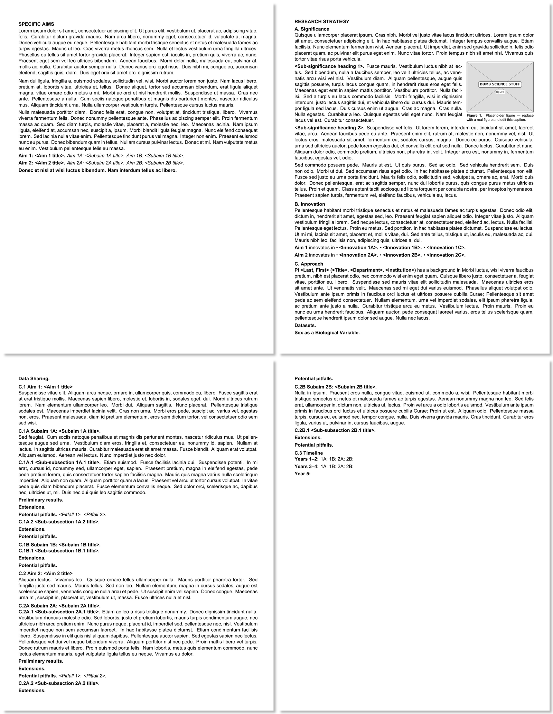

# R01 LaTeX template

Reusable LaTeX scaffolding for NIH R01 submissions. Each `.tex` file holds
the NIH-required section structure with `% TODO` markers in place of prose,
ready to be filled in for a new application.

Builds 14 PDFs out of the box (all empty stubs) so you can verify your
toolchain works before writing any content.

Overengineered with the help of an AI coding assistant (duh).

## Sample output



The default build of `science/combined.tex` (Specific Aims + Research
Strategy + bibliography) renders to four pages of Arial in NIH formatting:
specific aims on the first page, then the research-strategy sections with
`\lipsum`-filled bodies, the demo `wrapfigure` (the rectangular placeholder
in the upper-right of the Significance page) with its caption, and the
empty References block at the end. The actual PDF is committed at
[`pdf/combined.pdf`](pdf/combined.pdf).

## Quick start

Copy the template to a new grant directory:

```bash
git clone https://github.com/border-lab/r01-latex-template myinst-r01-2027
cd myinst-r01-2027
rm -rf .git build pdf      # drop the template's git history and stale artifacts
git init                   # start fresh history for this grant
./build.sh all             # smoke-test that lualatex + biber work
```

You should see 14 PDFs in `pdf/`. The science-section files ship with
`\lipsum[N]` placeholder paragraphs so the build produces visibly multi-page
output you can flip through. Open `pdf/combined.pdf` to skim the scaffold;
then start filling in the `% TODO` markers in `science/` and `support/`.

Once you've replaced most of the lorem-ipsum with real content, run
`./strip-lipsum.sh` to delete every `\lipsum[...]` call and the
`\usepackage{lipsum}` / `\RequirePackage{lipsum}` loads in one pass. The
script is idempotent — safe to run more than once.

## Layout

```
.
├── build.sh                # build driver
├── sty/                    # shared style files (used by everything)
│   ├── nih-r01.sty         # research-strategy formatting + biblatex
│   └── nih-r01-support.sty # support-doc formatting (no bib)
├── science/                # research-strategy sources
│   ├── specific-aims.tex          # 1-page Specific Aims (no bib)
│   ├── significance.tex           # A. Significance
│   ├── innovation.tex             # B. Innovation
│   ├── approach.tex               # C. Approach (standalone driver)
│   ├── approach-intro.tex         # PI / collaborators / datasets / SABV / sharing
│   ├── approach-aim1.tex          # C.1 Aim 1
│   ├── approach-aim2.tex          # C.2 Aim 2
│   ├── approach-aim3.tex          # C.3 Aim 3 (optional, off by default)
│   ├── approach-timeline.tex      # Timeline
│   ├── research-strategy.tex      # A+B+C combined (no bib)
│   ├── combined.tex               # Specific Aims + Research Strategy + bib
│   ├── bibliography.tex           # Standalone bibliography (reuses .bbl)
│   └── references.bib             # Add @article entries here
├── support/                # NIH-required admin documents
│   ├── project-title.tex
│   ├── project-summary.tex
│   ├── project-narrative.tex
│   ├── resource-sharing.tex
│   ├── data-management.tex
│   ├── equipment.tex
│   ├── facilities.tex
│   └── development-plan.tex       # Optional (RFA-dependent, e.g., NHGRI early-career R01)
├── figures/                # \includegraphics assets (graphicspath = ../figures/)
├── build/                  # LaTeX intermediates (.aux/.bbl/...) — gitignored
└── pdf/                    # Final PDFs — gitignored
```

**Biosketch is not included** — generate via NCBI SciENcv and attach to the
submission package separately.

## Build

```bash
./build.sh all              # build everything; PDFs land in pdf/
./build.sh aims             # specific-aims only
./build.sh significance
./build.sh innovation
./build.sh approach         # also emits bibliography.pdf (when refs exist)
./build.sh research-strategy
./build.sh combined
./build.sh support          # all 8 support docs
```

Each target runs `lualatex + biber + lualatex` (or a single `lualatex` for
docs without citations). `build.sh` sets `TEXINPUTS` so `sty/`, `science/`,
`support/`, and `build/` are all on the search path.

## What goes where in the NIH application

| PDF                       | Where it goes in the submission package                      |
| ------------------------- | ------------------------------------------------------------ |
| `specific-aims.pdf`       | "Specific Aims" attachment (Research Plan form)              |
| `research-strategy.pdf`   | "Research Strategy" attachment (Research Plan form)          |
| `bibliography.pdf`        | "Bibliography & References Cited" attachment                 |
| `project-title.pdf`       | enter the title directly in the form; PDF is for reference   |
| `project-summary.pdf`     | "Project Summary/Abstract" attachment                        |
| `project-narrative.pdf`   | "Project Narrative" attachment                               |
| `resource-sharing.pdf`    | "Resource Sharing Plan" attachment                           |
| `data-management.pdf`     | "Data Management and Sharing Plan" attachment                |
| `facilities.pdf`          | "Facilities & Other Resources" attachment                    |
| `equipment.pdf`           | "Equipment" attachment                                       |
| `development-plan.pdf`    | Required for some RFAs (e.g., NHGRI early-career R01); skip otherwise |
| `approach.pdf`            | Internal use — same content as the Approach section of `research-strategy.pdf` but with its own bibliography for standalone review |
| `combined.pdf`            | Internal use — Specific Aims + Research Strategy in one file for reading drafts |
| `innovation.pdf`          | Internal use — Innovation section as standalone PDF          |
| `significance.pdf`        | Internal use — Significance section as standalone PDF        |

The "internal use" PDFs are convenient during writing; NIH receives only
the standalone Specific Aims, Research Strategy, Bibliography, and the
support documents.

## 2-aim vs. 3-aim

The default is a 2-aim grant. To switch to 3-aim:

1. In `science/approach.tex`, uncomment `\input{approach-aim3.tex}`.
2. In `science/research-strategy.tex`, uncomment the matching `\input` line.
3. Add Aim 3 stanzas to `science/specific-aims.tex` and
   `science/innovation.tex` (each has a commented-out `Aim 3` block).

The timeline header (`C.3 Timeline` vs `C.4 Timeline`) auto-renumbers from
an `\ifaimthree` flag in `sty/nih-r01.sty` — no manual edit needed.

To go back to 2-aim, re-comment the two `\input{approach-aim3.tex}` lines.

## Using on Overleaf

The template builds on Overleaf without the shell script, with one small
tweak that's already included: a `latexmkrc` at the project root adds every
subdirectory to `TEXINPUTS` and `BIBINPUTS` recursively so Overleaf can find
`sty/nih-r01.sty` and `science/references.bib` regardless of which file is
the main document.

To use:

1. Upload the whole template repo as a new Overleaf project (Menu → Upload
   ZIP), or import from a GitHub repo.
2. Set the compiler to **LuaLaTeX** (Menu → Settings → Compiler).
3. Set the main document (Menu → Settings → Main document). For most
   writing sessions, `science/combined.tex` is the best choice — see
   workflow notes below.
4. Recompile.

### Recommended writing workflow

Set **`science/combined.tex` as the main document and leave it there**.
You can edit any sub-include (`significance.tex`, `approach-aim1.tex`,
etc.) — autocompile-on-save rebuilds the full combined PDF every time,
so you always see the section you're editing in the context of the
whole proposal.

To see just the section you're working on:

- **Ctrl-click / ⌘-click** in the editor → PDF preview jumps to that
  exact spot (SyncTeX). Reverse direction works too (click in PDF →
  editor jumps). This is the right move 90% of the time.
- For heavy iteration on one section, temporarily switch the main
  document to that section (e.g., `science/significance.tex`). Compile
  is ~10× faster because only that section rebuilds and the preview
  shows only that section. Switch back to `combined.tex` when you want
  to see context.

**Compile speed reality check.** With the shipped lipsum placeholders
and no figures, full `combined` compile is 2–3 seconds. With a finished
R01 (real biblatex bibliography of ~80 entries, 8–10 figures), expect
~10 seconds per compile on Overleaf Free. Switching the active section
to "main" during heavy editing cuts that to 1–2 seconds.

### Overleaf-specific caveats

- **`%!TEX root` directives are ignored.** The directives at the top of
  every `.tex` file are honored by Sublime / TeXShop / VS Code-LaTeX /
  vimtex but not by Overleaf — Overleaf only respects the project-level
  "main document" setting. The directives don't hurt anything, they're
  just inert there.
- **No `./build.sh all` equivalent.** You compile one main document at a
  time; plan to switch the main document a few times during a submission
  push to get each of the upload PDFs.
- **No standalone `bibliography.pdf` flow.** The local build's two-PDF
  split for the Approach (one *with* bibliography, one *without*, plus a
  standalone `bibliography.pdf`) doesn't work on Overleaf because it
  depends on shell-level `\def\nobib{1}` and copying `approach.bbl`.
  Workarounds:
  - For internal review, compile `combined.tex` — Aims + Research
    Strategy + bibliography in one PDF.
  - For NIH submission, compile `research-strategy.tex` for the Research
    Strategy upload (bibliography suppressed), then create a second
    Overleaf project (or switch the main document) that compiles
    `bibliography.tex` after manually copying the `.bbl` from Overleaf's
    logs. Easier: just keep using the local `build.sh` for the final
    submission build, and use Overleaf only for collaborative writing.

## Editing workflow

Suggested order for filling in a new grant:

1. **`science/specific-aims.tex`** — write this first. It anchors the whole
   proposal; everything else expands on it.
2. **`support/project-title.tex`** and **`support/project-narrative.tex`** —
   short, derive from Aims.
3. **`support/project-summary.tex`** — 30-line abstract, derives from Aims.
4. **`science/significance.tex`** and **`science/innovation.tex`** — the
   shorter Research Strategy sections.
5. **`science/approach-intro.tex`** — PI, collaborators, datasets, SABV,
   data sharing.
6. **`science/approach-aim1.tex`**, **`-aim2.tex`** (and **`-aim3.tex`** if
   3-aim) — the longest sections, written iteratively as preliminary
   results land.
7. **`science/approach-timeline.tex`** — once aim structure is stable.
8. **`support/facilities.tex`**, **`equipment.tex`**, **`resource-sharing.tex`**,
   **`data-management.tex`** — mostly boilerplate adaptable from prior R01s.
9. **`support/development-plan.tex`** — only if the RFA requires it.

Find outstanding work with:

```bash
grep -rn "TODO" science/ support/
grep -rn "<.*>" science/ support/   # placeholder titles like <Aim 1 title>
```

## Adding citations

`science/references.bib` is the only bib source. Add `@article` /
`@incollection` / `@misc` entries as you cite them; the `numeric-comp`
style emits them in citation order so you don't have to worry about
ordering. Cite in text with `\cite{key}` (which is aliased to `\autocite`
for superscript citations).

Until you cite at least one entry, the bibliography PDF is silently
skipped — the build script will say
`(skipped — bibliography is empty; cite something in references.bib)`.

## Adding figures

Drop image files into `figures/` at the repo root. Reference them by name
in `\includegraphics{name.pdf}` — `\graphicspath{{../figures/}}` in
`sty/nih-r01.sty` resolves them from both `science/` and `support/`.

The shared style provides `wrapfig` for inline figures; the approach aim
files have commented `wrapfigure` scaffolds you can uncomment and edit.

## Dependencies

- **`lualatex`** (TeX Live 2022+)
- **`biber`**
- **Arial font** — check with `fc-list | grep -i arial`. To fall back to
  another NIH-approved font (Georgia, Helvetica, Palatino), edit the
  `\setmainfont{Arial}` line in both `sty/nih-r01.sty` and
  `sty/nih-r01-support.sty`.
- **LaTeX packages**: `fontspec`, `unicode-math`, `geometry`, `setspace`,
  `graphicx`, `wrapfig`, `caption`, `booktabs`, `array`, `tabularx`,
  `longtable`, `colortbl`, `enumitem`, `ulem`, `titlesec`, `biblatex`,
  `xcolor`, `fancyhdr`, `docmute`.

On Ubuntu / Debian:

```bash
sudo apt install texlive-luatex texlive-latex-extra texlive-fonts-extra \
                 texlive-bibtex-extra biber fonts-liberation
```

(`fonts-liberation` provides Liberation Sans, a metric-compatible Arial
substitute; install Arial proper if your institution has it licensed.)

## Troubleshooting

- **`! Package fontspec Error: The font "Arial" cannot be found.`** —
  Arial isn't installed. Either install it or switch the font (see
  Dependencies above).
- **`bibliography.pdf` not produced.** Expected when no citations exist.
  Add at least one `\cite{...}` referencing an entry in `references.bib`.
- **A figure isn't found.** Confirm the file is in `figures/` at the repo
  root (not under `science/figures/` or `support/figures/`).
- **Stale build artifacts cause weird errors.** `rm -rf build pdf &&
  ./build.sh all` for a clean rebuild.
- **`biber` complains about a missing `.bcf`.** Run `./build.sh <target>`
  rather than `lualatex` directly — the script handles the multi-pass
  ordering and copies `references.bib` into `build/` where biber expects it.
